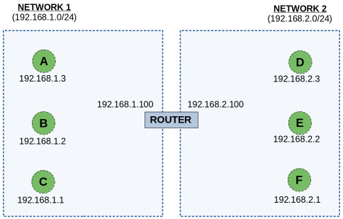
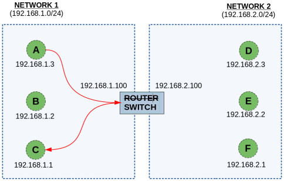
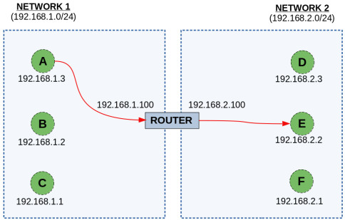
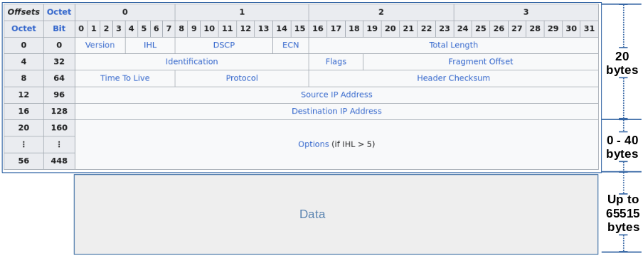
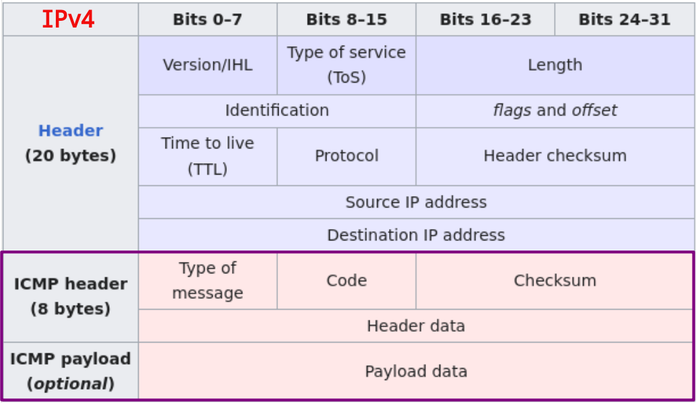
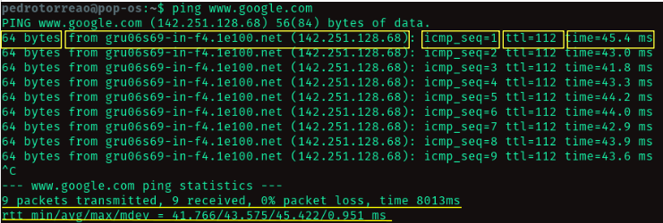
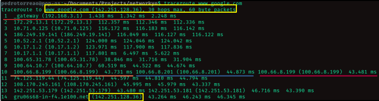

# NETWORKING FUNDAMENTALS

### TABLE OF CONTENTS

- [OSI MODEL](#osi-model-open-systems-interconnection)
- [INTERNET PROTOCOL (IP)](#internet-protocol-ip)
  - [IP Packet Structure](#ip-packet-structure)
  - [Internet Control Message Protocol (ICMP)](#internet-control-message-protocol-icmp)
  - [Address Resolution Protocol (ARP)](#address-resolution-protocol-arp)
  - [Dynamic Host Configuration Protocol (DHCP)](#dynamic-host-configuration-protocol-dhcp)
  - [Domain Name System (DNS)](#domain-name-system-dns)
- [USER DATAGRAM PROTOCOL (UDP)](#user-datagram-protocol-udp)
- [TRANSMISSION CONTROL PROTOCOL (TCP)](#transmission-control-protocol-tcp)
- [USEFUL COMMAND LINE UTILITIES](#useful-command-line-utilities)
  - [ping](#ping)
  - [traceroute](#traceroute)
  - [tcpdump](#tcpdump)
- [REFERENCES](#references)

---

## OSI MODEL (OPEN SYSTEMS INTERCONNECTION)

Conceptual model which enables different communication systems to communicate with each other using standard protocols. This model consists in splitting up a communication system into 7 abstract layers.

### Layer 7 - Application (HTTP, FTP, gRPC, SMTP)

- **Purpose**: Human-computer interaction layer, where applications can access the network services. Software applications like web browsers and email clients rely on the application layer to initiate communications. However, client software applications are not part of the Application Layer; rather this Layer is responsible for the protocols and data manipulation that the software relies on to present meaningful data to the user.
- **Examples**: HTTP (Hypertext Transfer Protocol), SMTP (Simple Mail Transfer Protocol).
- **Devices/Processes**: Web browsers, email clients, file transfer software.

```
          request
        +-------->
WEBSITE             APPLICATION LAYER
        <--------+
          response
```

### Layer 6 - Presentation (Encoding, Serialization)

- **Purpose**: Ensures that data is in an usable format and is where data encryption works. Layer responsible for preparing data so that it can be used by the Application layer, i.e. this layer makes the data presentable for applications to consume. It is also responsible for translation (`encoding`), encryption (`encrypt/unencrypt`) and compression (`speed/efficiency`) of data.
- **Examples**: SSL/TLS encryption, data compression.
- **Devices/Processes**: Encryption/decryption software, compression/decompression. algorithms.

```
ENCRYPTION +--------> COMPRESSION +--------> TRANSLATION
```

### Layer 5 - Session (Connection establishment, TLS)

- **Purpose**: Maintains connections and is responsible for controlling ports and sessions. The time between the opening and closing of a connection is known as session. This Layer also ensures that the session stays open long enough to transfer all the data being exchanged, and finishes the session to avoid wasting resources. The session layer also synchronizes data tranfers with checkpoints.
  - For example, if a `100MB` file is being transferred, the Session Layer could set a checkpoint every `5MB`. This way, in the event that some error happens during the transference when `58MB` have already been transferred, the session could be resumed from the last checkpoint, i.e. `55MB`, and only `45MB` would be left to transfer instead of having to transfer the whole file again.
- **Examples**: Session management.
- **Devices/Processes**: Session management software libraries, application-level gateways (ALGs).

### Layer 4 - Transport (UDP, TCP)

- **Purpose**: Transmits data using transmission protocols such as TCP and UDP. Layer responsible for end-to-end communication between two devices. This includes taking data from the Session Layer and breaking it up into chunks called _**segments**_ before sending it to the Network layer. The Transport layer on the receiving end is responsible for reassembling the _**segments**_ into data that the Session layer can consume. This layer also performs flow control and error control. Flow control determines an optimal speed of transmission to ensure that one device do not overwhelm the other. Error control makes sure that the data received is complete, and request a retransmission if it isn't.
- **Examples**: TCP (Transmission Control Protocol), UDP (User Datagram Protocol) segments.
- **Devices/Processes**: Firewalls, load balancers.

```
SEGMENTATION +--------> TRANSPORT +--------> REASSEMBLY
```

### Layer 3 - Network (IP - Internet Protocol)

- **Purpose**: Decides which physical path the data will take. It is responsible for facilitating data transfer between two different networks. If the two devices communicating are on the same network, then the Network layer is unnecessary. This layer breaks up _**segments**_ from the Transport layer into smaller units called **_packets_** on the sender's device and reassembles them on the receiver's device. It also finds the best physical path for the data to reach its destination, which is known as **routing**.
- **Examples**: IP (Internet Protocol) packets.
- **Devices/Processes**: Routers, layer 3 switches.

### Layer 2 - Datalink (Frames, MAC Address)

- **Purpose**: Defines the format of the data in the network. Similar to the Network layer, except that the Datalink layer facilitates data transfer between two devices on the same network, i.e. it is responsible for the reliable transmission of data between directly connected nodes on a local network. It takes _**packets**_ from the Network layer and breaks them into smaller pieces called **_frames_**. Also, it is responsible from flow control and error detection in intra-network communication.
- **Examples**: Ethernet frames, MAC (Media Access Control) addresses.
- **Devices/Processes**: Network switches, network interface cards (NICs).

### Layer 1 - Physical (Electric signals, fiber optics, radio waves)

- **Purpose**: Transmits raw bit streams over the physical medium. It includes the physical equipment involved in the data transfer, such as cables, switches and connectors. This is also the layer where data gets converted into a bit stream. The Physical layer of both devices must also agree on a signal convention so that the `1`s can be distinguished from the `0`s on both devices (e.g., voltage levels).
- **Examples**: Ethernet cables, fiber optics, wireless radio waves.
- **Devices/Processes**: Network cables, switches, repeaters, hubs.

### Summary

| **LAYER** | **OUTPUT** | **EXAMPLE** |
| :-: | :-: | :-: |
| **7- APPLICATION** | APPLICATION DATA AND MESSAGES | WEB BROWSERS, EMAIL CLIENTS, FTP, HTTP |
| **6- PRESENTATION** | TRANSLATED, ENCRYPTED, OR COMPRESSED DATA | SSL/TLS ENCRYPTION, IMAGE COMPRESSING |
| **5- SESSION** | CONNECTION ESTABLISHMENT, MAINTENANCE AND TERMINATION | RPC (REMOTE PROCEDURE CALL) |
| **4- TRANSPORT** | SEGMENTS OR DATAGRAMS | PROXY, FIREWALL, LOAD BALANCERS |
| **3- NETWORK** | PACKETS WITH IP ADDRESSES | ROUTERS, LAYER 3 SWITCHES |
| **2- DATA LINK** | FRAMES WITH MAC ADDRESSES | ETHERNET SWITCHES, NICs |
| **1- PHYSICAL** | RAW BINARY DATA BITS | RADIO WAVES (WI-FI), ELECTRIC SIGNAL (ETHERNET CABLES), LIGHT (FIBER OPTICS) |

:arrow_right_hook: [TABLE OF CONTENTS](#table-of-contents)

# INTERNET PROTOCOL (IP)

The Internet Protocol (IP) is a Layer 3 protocol which can be defined as a set of rules and conventions that govern the routing and addressing of data packets in computer networks, enabling data to be transmitted and received across interconnected networks. It ensures that data packets are correctly directed from the source to the destination based on unique numerical addresses assigned to devices on the network and it also includes mechanisms for error handling, fragmentation, and reassembly of data packets to facilitate reliable communication between devices over diverse network infrastructures.

- **IPv4**: Internet Protocol version, used by most domains and devices.

  - _Length_: IPv4 uses `32-bit` addresses, which allows for approximately 4.3 billion unique IP addresses.
  - _Format_: Typically written in dotted-decimal format (e.g., `192.168.254.1`), where each of the four decimal numbers represents 8 bits octets (`2^8` = `256 numbers`, ranging from `0` to `255`).
  - _Address Exhaustion_: IPv4 has run into the problem of address exhaustion due to the limited number of available addresses. This led to the development of IPv6.

- **IPv6**:

  - _Length_: IPv6 uses `128-bit` addresses, which provides enough number of unique IP addresses (approximately 340 undecillion addresses).
  - _Format_: Addresses are written in hexadecimal format with colons (e.g., `2001:0db8:85a3:0000:0000:8a2e:0370:7334`). Each hexadecimal digit needs `4` bits to be represented, since we have `8` groups of `4` hexadecimal digits, we need then `(8 * 4) hexadecimal digits * 4 bits = 128 bits` in total.
  - _Address Exhaustion_: IPv6 was designed to eliminate address exhaustion and provide a virtually limitless pool of IP addresses to accommodate the growing number of internet-connected devices.

- **Other features of IPv6**:
  - _Address Hierarchy_: hierarchical addressing structure, making network routing more efficient and reducing the size of routing tables.
  - _Autoconfiguration_: includes built-in support for stateless address autoconfiguration, simplifying the process of assigning IP addresses to devices.
  - _Security_: improved security features compared to IPv4, including built-in IPsec support for secure communication.

### Subnets

Logical subdivision of an IP network. It groups a set of devices within a larger IP network into smaller, isolated segments. Devices within a subnet can communicate directly with each other without the need for routing.

    SUBNET = (IP address) & (SUBNET MASK)

### Subnet Mask

32-bit numeric address that divides an IP address into a network portion and a host portion. It determines which part of an IP address belongs to the network and which part belongs to the specific device within that network. When a device wants to communicate with another device on the same subnet, it checks if the destination IP address falls within the same network segment. This check is done by applying a bitwise AND operation between the IP address and the subnet mask. If the result matches the network address of the sender, the destination is on the same subnet.

### Default Gateway

Network device, usually a router, that serves as the routing entry point for data traffic leaving a local network and heading toward external networks or destinations. It acts as an intermediary between devices within the local network and external networks, such as the internet, by forwarding data packets to their appropriate destinations. The default gateway is typically configured with an IP address, and devices within the local network are configured to use this IP address as the route for sending data outside of their local network segment.

- Networks usually consist of various hosts and a Default Gateway.
- A host can talk directly to another if both are in the same subnet. Otherwise, the sender sends the package to the Default Gateway, which then forwards it to the receiver.
- Each host should know its gateway' IP address.

#### Example 1 - Working with Subnets and Subnet Masks:

Consider the IP address `192.168.254.0/24`:

- The first portion `192.168.254`, corresponding to `24` bits (`3` octets), is used to represent the network portion of the IP address.
- The last `8` bits, the `.0` portion, tells us that these `8` bits are reserved for the host.
- This arrangement will give us `2^24 = 16777216` possible networks, each having `2^8 = 256` hosts.
- `192.168.254.0/24` is also called a **SUBNET** and this subnet has the **SUBNET MASK** `255.255.255.0`.

#### Example 2 - Working with Subnets and Subnet Masks:

Consider the following network configuration with the subnet mask `255.255.255.0`.



a. Host **A** (`192.168.1.3`) wants to talk to host **B** (`192.168.1.2`):

1. Apply the subnet to both hosts:

   - `SUBNET_A` = `IP_A & SUBNET MASK` = `(192.168.1.3) & (255.255.255.0)` = `192.168.1.0`
   - `SUBNET_B` = `IP_B & SUBNET MASK` = `(192.168.1.2) & (255.255.255.0)` = `192.168.1.0`

2. Comparing both subnets obtained, we can see that they are the same, so hosts **A** and **B** are in the same network, no need for routing. The router, in this case, behaves like a Layer 2 switch.



b. Host **A** (`192.168.1.3`) wants to talk to host **E** (`192.168.2.2`):

1. Apply the subnet to both hosts:

   - `SUBNET_A` = `IP_A & SUBNET MASK` = `(192.168.1.3) & (255.255.255.0)` = `192.168.1.0`
   - `SUBNET_E` = `IP_E & SUBNET MASK` = `(192.168.2.2) & (255.255.255.0)` = `192.168.2.0`

2. Comparing both subnets obtained, we can see that they are the different, so hosts **A** and **E** are in different networks, the packet sent by **A** will need to be sent to the default gateway/router (`192.168.1.100`), which is in the same subnet as **A**.
3. The router then looks for host **E** in other networks it's connected to. It finds **E** in other network and forwards it the package sent by **A**.



> TIP: if you application and its database are in different subnets, the IP packets containing your SQL queries will always need to go through the router which, if congested, will possibly cause delays.

### IP Packet Structure

An IP packet consists of a **header** section and a **data** section. The IP **header** is usually `20` bytes, but it can go up to `60` bytes in case options are enabled. The `data ` section can go up to `65515` bytes. It has no data checksum or any other footer after the data section. Typically the Data Link Layer encapsulates IP packets in frames with a CRC footer that detects most errors, many transport-layer protocols carried by IP also have their own error checking.

How the Backend engineer usually sees the IP packet:

      | SOURCE IP ADDRESSS | DATA | DESTINATION IP ADDRESS |

How it actually looks like:



_Source: [Michel Bakni - Postel, J. (September 1981) RFC 791, Internet Protocol, DARPA Internet Program Protocol Specification, The Internet Society](https://commons.wikimedia.org/w/index.php?curid=79949694)_

#### IP Packet Header

The IPv4 packet header consists of `14` fields, of which `13` are required. The 14th field is optional and the reason why the IPv4 header is variable in size. The fields in the header are packed with the most significant byte first (network byte order). So, the most significant bit is numbered 0.

- **_Version_**:
  ```
  The first header field in an IP packet is the four-bit version field. For IPv4, this is always equal to 4. For IPv6, it is always equal to 6.
  ```
- **_IHL_** - Internet Header Length:
  ```
  The IHL field is a 4-bit field containing the size of the IPv4 header. Its 4 bits specify the number of 32-bit words in the header. The minimum value for this field is 5, when no options are specified, which indicates a length of 5 × 32 bits = 160 bits = 20 bytes. As a 4-bit field, the maximum value is 15; this means that the maximum size of the IPv4 header is 15 × 32 bits = 480 bits = 60 bytes.
  ```
- **_DSCP_** - Differentiated Services Code Point:

  ```
  It specifies differentiated services (DiffServ). Real-time data streaming makes use of the DSCP field. An example is Voice over IP (VoIP), which is used for interactive voice services.

  ```

- **_ECN_** - Explicit Congestion Notification:

  ```
  This field allows end-to-end notification of network congestion without dropping packets. ECN is an optional feature available when both endpoints support it and effective when also supported by the underlying network.
  ```

- _**Total length**_:

  ```
  This 16-bit field defines the entire packet size in bytes, including header and data. The minimum size is 20 bytes (header without data) and the maximum is 65535 bytes.
  ```

- _**Identification**_:

  ```
  Identification field primarily used for uniquely identifying the group of fragments of a single IP datagram.
  ```

- _**Flags**_:

  ```
  A three-bit field used to control or identify fragments. They are (in order, from most significant to least significant):
      bit 0: Reserved; must be zero.
      bit 1: Don't Fragment (DF).
        --> If the DF flag is set and fragmentation is required to route the packet,
            then the packet is dropped. This can be used when sending packets to a host
            that does not have resources to perform reassembly of fragments. It can also
            be used for path MTU discovery, either automatically by the host IP
            software, or manually using diagnostic tools such as ping or traceroute.
      bit 2: More Fragments (MF)
        --> The MF flag is cleared for unfragmented packets. For fragmented packets,
            all fragments except the last have the MF flag set. The last fragment has a
            non-zero Fragment Offset field, differentiating it from an unfragmented
            packet.
  ```

- _**Fragment offset**_:

  ```
  This field specifies the offset of a particular fragment relative to the beginning of the original unfragmented IP datagram. The fragmentation offset value for the first fragment is always 0.
  ```

- _**TTL**_ - Time To Live:

  ```
  An 8-bit time to live field limits a datagram's lifetime to prevent network failure in the event of a routing loop. It is specified in seconds, but time intervals less than 1 second are rounded up to 1. In practice, the field is used as a hop count—when the datagram arrives at a router, the router decrements the TTL field by one. When the TTL field hits zero, the router discards the packet and typically sends an ICMP time exceeded message to the sender.
  ```

- _**Protocol**_:

  ```
  This field defines the protocol used in the data portion of the IP datagram. Some examples:
      1:  Internet Message Protocol (ICMP)
      6:  Transmission Control Protocol (TCP)
      17: User Datagram Protocol (UDP)
  ```

- _**Header checksum**_:

  ```
  This 16-bit field is used for error-checking of the header. When a packet arrives at a router, the router calculates the checksum of the header and compares it to the checksum field. If the values do not match, the router discards the packet.

  When a packet arrives at a router, the router decreases the TTL field in the header. Consequently, the router must calculate a new header checksum. The checksum field is the 16 bit one's complement of the one's complement sum of all 16 bit words in the header. For purposes of computing the checksum, the value of the checksum field is zero.
  ```

- _**Source address**_:

  ```
  This 32-bit field is the IPv4 address of the sender of the packet. It may be changed in transit by network address translation (NAT).
  ```

- _**Destination address**_:

  ```
  This 32-bit field is the IPv4 address of the receiver of the packet. It may be affected by NAT.
  ```

- _**Options**_:

  ```
  The options field is not often used. Packets containing some options may be considered as dangerous by some routers and be blocked.
  ```

#### IP Packet Data

The content of the IP packet data is interpreted based on the value set for the _**Protocol**_ field in the IP header. Some examples are:

      1:  Internet Message Protocol (ICMP)
      6:  Transmission Control Protocol (TCP)
      17: User Datagram Protocol (UDP)

The packet payload is not included in the checksum. Its contents are interpreted based on the value of the Protocol header field.

- _**Fragmentation**_:

  ```
  Networks with different hardware usually vary not only in transmission speed, but also in the maximum transmission unit (MTU). Therefore, when one network wants to transmit datagrams to a network with a smaller MTU, it may fragment its datagrams.

  When a router receives a packet, it examines the destination address and determines the outgoing interface to use and that interface's MTU. If the packet size is bigger than the MTU, and the Do not Fragment (DF) bit in the packet's header is set to 0, i.e. fragmentation is allowed, then the router may fragment the packet.
  ```

- _**Reassembly**_:

  ```
  A receiver knows that a packet is a fragment, if at least one of the following conditions is true:
    - The flag more fragments (MF) is set, which is true for all fragments except the last.
    - The field fragment offset is nonzero, which is true for all fragments except the first.

  The receiver identifies matching fragments using the source and destination addresses, the protocol ID, and the identification field. The receiver reassembles the data from fragments with the same ID using both the fragment offset and the more fragments flag.
  ```

### Internet Control Message Protocol (ICMP)

Supporting protocol used by network devices (e.g. routers) to send error messages and operational information indicating success or failure when communicating with other IP addresses. However, unlike transport protocols like TCP and UDP, ICMP is not typically used to exchange data between systems nor used by end-user network applications.

      ICMP messages are sent in several situations:  for example, when a
      datagram cannot reach its destination, when the gateway does not have
      the buffering capacity to forward a datagram, and when the gateway
      can direct the host to send traffic on a shorter route.

ICMP is used as the basis for diagnostic tools such as [`ping`](#ping) and [`traceroute`](#traceroute).

ICMP is a network-layer protocol, this makes it layer 3 protocol by the 7 layer [**OSI model**](#osi-model-open-systems-interconnection). This way, there is no TCP or UDP port number associated with ICMP packets as these numbers are associated with the transport layer above.

#### ICMP Packet Header

The ICMP packet is encapsulated in an IPv4 packet. The packet consists of header and content sections. See a simplified example below:



- _**Type**_:

  ```
  First octet of the data portion. Its value determines the format of the remaining data and which kind of control messages will be sent. See examples below:
    0- Echo Reply
    3- Destination Unreachable
    5- Redirect Message
    8- Echo Request
    11- Time Exceeded
    30- Traceroute

  ```

- _**Code**_:

  ```
  The Code field represents an ICMP subtype. Given the value in the Type field, the Code gives additional context information for the message. See examples below:
      - Type = 3 - Destination Unreachable:
          - Code = 0: Destination network unreachable
          - Code = 3: Destination port unreachable
          - Code = 4: Fragmentation required, and DF (Don't Fragment) flag set

      - Type = 11 - Time Exceeded:
          - Code = 0: TTL expired in transit
          - Code = 1: Fragment reassembly time exceeded
  ```

- _**Checksum**_:

  ```
  Checksum for error checking, calculated from the ICMP header and data with value 0 substituted for this field.
  ```

- _**Content/Rest of header**_:

  ```
  ICMP error messages contain a data section that includes a copy of the entire IPv4 header, plus at least the first eight bytes of data from the IPv4 packet that caused the error message. This data is used by the host to match the message to the appropriate process.
  ```

**Note**:

- Some firewalls block ICMP for security reasons, so tools like `ping` might not work for those cases. However, disabling ICMP also can cause problems with connection establishment (i.e. fragmentation needed).
- To avoid the infinite regress of messages about messages etc., no ICMP messages are sent about ICMP messages.

:arrow_right_hook: [TABLE OF CONTENTS](#table-of-contents)

### Address Resolution Protocol (ARP)

Request-response protocol used to associate an Internet Protocol (IP) address to a fixed physical machine address, or media access control (MAC) address, in a local-area network (LAN). [The MAC address is part of the data link layer, which establishes and terminates a connection between two physically connected devices so that data transfer can take place. The IP address is also referred to as the network layer or the layer responsible for forwarding packets of data through different routers. ARP works between these layers.](https://www.fortinet.com/resources/cyberglossary/what-is-arp).

    All hosts on a network are located by their IP address, but NICs (Network Interface Card) do not have IP addresses, they have MAC addresses. We need MAC addresses to send frames (layer 2).

The ARP Table is a cached `IP Address ---> MAC Address` mapping. Every time a host wants to send a packet to another host, say IP address `10.5.5.1`, on its local area network (LAN), it first verifies its ARP Table to see if the IP-to-MAC-address mapping has already been done. If so, there is no need for a new request. Otherwise, it broadcasts an ARP packet. The ARP packet contains a simple question: **What is the MAC address corresponding to IP address** `10.5.5.1`**?** Then, the host that has been configured to use the IP address `10.5.5.1` responds with an ARP packet containing its MAC address.

#### ARP Poisoning

Malicious attack in which fake ARP messages are sent to a target network aiming to link their MAC address with the IP address of a legitimate device or server within the network. This allows for data from the target's device to be sent to the attacker's computer instead of the original destination.

#### Man-in-the-Middle Attacks (MITM)

A man-in-the-middle (MITM) attack is a type of eavesdropping in which the cyberattacker intercepts, relays, and alters messages between two parties—who have no idea that a third party is involved—to steal information. The attacker may try to control and manipulate the messages of one of the parties, or of both, to obtain sensitive information.

#### Session Hijacking

Session hijacking occurs when a cyberattacker steals a user's session ID, takes over that user's web session, and masquerades as that user. With the session ID in their possession, the attacker can perform any task or activity that user is authorized to do on that network.

Authentication occurs when a user tries to gain access to a system or sign in to a restricted website or web service. The session ID is stored in a cookie in the browser, and an attacker engaged in session hijacking will intercept the authentication process and intrude in real time.

#### Denial-of-Service (DoS) Attack

A denial-of-service (DoS) attack is one in which a cyberattacker attempts to overwhelm systems, servers, and networks with traffic to prevent users from accessing them. A larger-scale DoS attack is known as a distributed denial-of-service (DDoS) attack, where a much larger number of sources are used to flood a system with traffic.

### Dynamic Host Configuration Protocol (DHCP)

Network management protocol used on IP networks for automatically assigning IP adresses and other communication parameters to devices connected to the network using a client-server architecture.

IP addresses may be changed frequently, but these updates are not performed randomly, there are rules for allocating an IP address from a defined range of numbers available in a specific network. These rules are known as DHCP or Dynamic Host Configuration Protocol.

#### DHCP Server

The DHCP server manages a pool of IP addresses and information about client configuration parameters such as default gateway, domain name, the name servers, and time servers. On receiving a `DHCP request`, the DHCP server may respond with specific information for each client, as previously configured by an administrator, or with a specific address and any other information valid for the entire network and for the time period for which the allocation (lease) is valid.

#### DHCP Client

When a computer or other device connects to a network, the DHCP client software sends a DHCP broadcast query requesting the necessary information. A DHCP client typically queries this information immediately after booting, and periodically thereafter before the expiration of the information. Any DHCP server on the network may service the request.

#### DHCP Relay

Any TCP/IP host that forwards DHCP messages between servers and clients. A DHCP relay plays an essential role, for instance, when a network consists of several subnetworks.

#### DHCP Operation

There are 4 phases during the DHCP operations: server **_discovery_**, IP lease **_offer_**, IP lease _**request**_, and IP lease _**acknowledgement**_. These stages are often abbreviated as **DORA** for discovery, offer, request, and acknowledgement.

- **Discovery**:

The DHCP operation begins with clients broadcasting a request. If the client and server are in different Broadcast Domains, a DHCP Helper or DHCP Relay Agent may be used. The DHCP client broadcasts a `DHCPDISCOVER` message on the network subnet using the destination address `255.255.255.255` (limited broadcast) or the specific subnet broadcast address (directed broadcast). A DHCP client may also request a specific IP address in the `DHCPDISCOVER`.

- **Offer**:

Upon receiving a `DHCPDISCOVER` message from a client, which is an IP address lease request, the DHCP server reserves an IP address for the client and makes a lease offer by sending a `DHCPOFFER` message to the client. This message contains the client's client id (traditionally a MAC address), the IP address that the server is offering, the subnet mask, the lease duration, and the IP address of the DHCP server making the offer.

- **Request**:

In response to the DHCP offer, the client replies with a `DHCPREQUEST` message, broadcast to the server, requesting the offered address. A client can receive DHCP offers from multiple servers, but it will accept only one DHCP offer. To find out whether there is another host in the network using the offered IP address, before claiming it, the client broadcasts an ARP request. If there is no reply, this address does not conflict with that of another host, so it is free to be used. The client, then, sends the server identification option in the `DHCPREQUEST` message, indicating the server which offered the IP address chosen. Upon receiving this message, other DHCP servers withdraw any offers that they have made to the client and return their offered IP address to the pool of available addresses.

- **Acknowledgement**:

When the DHCP server receives the `DHCPREQUEST` message from the client, the configuration process enters its final phase. The acknowledgement phase involves sending a `DHCPACK` packet to the client. This packet includes the lease duration and any other configuration information that the client might have requested. At this point, the IP configuration process is completed.

### Domain Name System (DNS)

Users access information online through domain names, like `google.com` or `twitter.com`. Web browsers interact through Internet Protocol (IP) addresses. **DNS translates domain names to IP addresses** so browsers can load Internet resources, eliminating the need for humans to memorize IP addresses such as `192.168.1.1` (in IPv4), or `2400:cb00:2048:1::c629:d7a2` (in IPv6).

Once the DNS server finds the correct IP address, browsers take the address and use it to send data to content delivery network (CDN) edge servers or origin servers. Once this is done, the information on the website can be accessed by the user. The DNS server starts the process by finding the corresponding IP address for a website’s uniform resource locator (URL).

#### DNS Operation

In a usual DNS query, the URL typed in by the user has to go through four servers for the IP address to be provided. See a brief overview of these servers below:

- _**DNS Recursor**_

Also referred to as a DNS resolver, it is a server designed to receive queries from client machines through applications such as web browsers. It is responsible for communicating with other DNS servers (root nameservers, top-level domain (TLD) nameservers, and authoritative nameservers) to find the right IP address.

- _**Root nameserver**_

It is the first step in translating (resolving) human readable host names into IP addresses. Typically, it serves as a reference to other more specific locations.

- _**Top Level Domain (TLD) nameserver**_

This server is responsible for hosting the last portion of a hostname (In example.com, the TLD server is “com”).

- _**Authoritative nameserver**_

An authoritative nameserver is what gives you the real answer to your DNS query, it is the last stop in the nameserver query. If the authoritative name server has access to the requested record, it will return the IP address for the requested hostname back to the DNS Recursor that made the initial request.

#### Authoritative DNS Server

It is the server that actually holds, and is responsible for, DNS resource records. This is the server at the bottom of the DNS lookup chain that will respond with the queried resource record. An authoritative nameserver can satisfy queries from its own data without needing to query another source, as it is the final source of truth for certain DNS records.

#### Recursive DNS Resolver

It is the computer that responds to a recursive request from a client and tracks down the DNS record. It does this by making a series of requests until it reaches the authoritative DNS nameserver for the requested record (or times out or returns an error if no record is found). Recursive DNS resolvers uses caching mechanisms to not always need to make multiple requests in order to track down the records needed to respond to a client .

### DNS Lookup

There are typically 8 steps in a DNS lookup. When DNS information is cached, steps are skipped from the DNS lookup process which makes it quicker. The example below outlines all 8 steps when nothing is cached.

1. A user enters a website address into a browser (i.e. `google.com`). This query is received by a DNS recursive resolver.
2. The resolver then queries the DNS Root nameserver.
3. The DNS Root nameserver then responds to the resolver with the address of a Top Level Domain (TLD) DNS server (such as .com or .org), which stores the information for its domains (i.e. `.com` for our example).
4. The DNS resolver then makes a request to the `.com` Top Level Domain (TLD) server.
5. The TLD server then responds with the IP address of the domain’s nameserver.
6. The DNS recursive resolver sends a query to the domain’s nameserver.
7. The IP address for `google.com` is then returned to the resolver from the nameserver.
8. The DNS resolver then responds to the web browser with the IP address of the domain requested initially.

After the above steps for the DNS lookup are finished, the browser can make a HTTP request to the IP address received and the server at that IP returns the contents of the webpage to be rendered in the browser.

:arrow_right_hook: [TABLE OF CONTENTS](#table-of-contents)

# USER DATAGRAM PROTOCOL (UDP)

**Layer 4**, Transport layer in the [OSI Model](#osi-model), communication protocol, i.e. _standardized method for transferring data_, which offers the ability to address processes in a host using _**ports**_. 

UDP is a simple protocol that does not require prior communication and it is used across the internet for especially time-sensitive transmissions such as video playback and DNS lookups. It speeds up communications by **NOT** formally establishing a connection before data is transferred, which allows data to be transferred very quickly, but it can also cause packets/datagrams to be lost and create opportunities for exploitation in the forms of DDoS attacks. 

UDP provides a way for application programs to send messages to other programs with a minimum of protocol mechanism. It is transaction oriented, and delivery and duplicate protection are not guaranteed. Packets/datagrams are sent directly to a target computer, without establishing a connection first, indicating the order of said packets, or checking whether they arrived as intended. Applications for which these features are mandatory should use the [Transmission Control Protocol (TCP)](#tcp---transmission-control-protocol).

### UDP use cases

- Video streaming
- VoIP (voice over IP)
- Online gaming
- VPN - Virtual Private Network
- DNS - Domain Name Server
- WebRTC - P2P Communication

### Multiplexing and demultiplexing

- IP target hosts only.
- Hosts run many apps/processes, each possibly having different requirements.
- Ports are used in UDP to identify the app/process.
- Sender multiplexes all of its apps/processes into UDP.
- Receiver demultiplexes UDP datagrams to each app.

### UDP Datagram

- UDP Datagram Header is 8 bytes only (IPv4).
	- 4 fields, 2 bytes each.
- Datagrams slide into an IP packet as "data".
- Ports are 16 bits (0 to 65535)
- UDP Header:
```
                  0      7 8     15 16    23 24    31  
                 +--------+--------+--------+--------+ 
                 |     Source      |   Destination   | 
                 |      Port       |      Port       | 
                 +--------+--------+--------+--------+ 
                 |                 |                 | 
                 |     Length      |    Checksum     | 
                 +--------+--------+--------+--------+ 
                 |                                     
                 |          data octets ...            
                 +---------------- ...
```
- ***Source Port***: it is an _optional_ field which indicates the port of the sending process, and may be addressed in the absence of any other information. If not used, a value of zero is inserted.
- ***Destination Port***: _required_ field, it identifies the receiver's destination address, including the port number.
- ***Length***: it's the length in octets of this user datagram including the header and the data. This means that the minimum value of the length is 8, the length of the header.
- ***Checksum***: *16-bit one's complement of the one's complement sum of a pseudo header of information from the IP header, the UDP header, and the data, padded with zero octets at the end (if necessary) to make a multiple of 2 octets*. The pseudo header conceptually prefixed to the UDP header contains the source address, the destination address, the protocol, and the UDP length. This information gives protection against misrouted datagrams. This checksum procedure is the same as is used in TCP. The checksum field may be used for error-checking of the header and data. This field is optional in IPv4, and mandatory in most cases in IPv6.
```
                  0      7 8     15 16    23 24    31 
                 +--------+--------+--------+--------+
                 |          source address           |
                 +--------+--------+--------+--------+
                 |        destination address        |
                 +--------+--------+--------+--------+
                 |  zero  |protocol|   UDP length    |
                 +--------+--------+--------+--------+
```
If the computed checksum is zero, it is transmitted as all ones (the equivalent in one's complement arithmetic). An all zero transmitted checksum value means that the transmitter generated no checksum.

### UDP Pros

- Simple protocol.
- Header size is small ➡️ datagrams are small.
  - Uses less bandwidth.
- Stateless.
  - Consumes less memory, since no state is stored in the server/client.
- Low latency due to the lack of features such as handshake, ordering, re-transmission and guaranteed delivery.

### UDP Cons

- No acknowledgement, so you don't really know whether data sent was delivered or not.
- No guaranteed delivery.
- Connection-less, so anyone can send data without prior knowledge.
  - Not very secure ➡️ it can be easily spoofed.
- No flow control.
- No congestion control.
- No ordered packets.


#### Example - UDP Server in C:

To compile the code below, open your terminal inside the directory where the code file is and enter the following, assuming you have a C compiler available: `g++ udp-server.c -o udps`.

Then, it is just a matter of running the executable: `./udps`. To terminate the program, enter `Ctrl + C`.

To talk to the server, you can run follow a similar process to run the client code in the next example, or use the [netcat](#netcat) command line tool by entering the following commands in your terminal:
```
nc -u ip port  [Enter]
your_message   [Enter]
```
For example, `nc -u 127.0.0.1 5550`. After running this command, everything you type next is data that will be sent to the server.

```c
// inspired by: https://github.com/nikhilroxtomar/UDP-Client-Server-Program-in-C
// -----------------------------------------------------------------------------

#include <arpa/inet.h>
#include <netinet/in.h>
#include <stdio.h>
#include <stdlib.h>
#include <string.h>
#include <sys/socket.h>
#include <sys/types.h>

int main(int argc, char **argv) {
  // port number to be connected to.
  // note: All ports below 1024 are reserved, so we can set a port above 1024
  // and below 65535 unless they are being used by other programs.
  int port = 5550;
  // integer that will represent the file descriptor for the socket:
  int sockfd;
  // structures describing the socket addresses:
  struct sockaddr_in myaddr, remoteAddr;
  // buffer where the message will be stored:
  char buffer[1024];

  socklen_t addr_size;

  // create a new datagram (UDP) socket:
  sockfd = socket(AF_INET, SOCK_DGRAM, 0);

  // initialize the structure variables to NULL:
  memset(&myaddr, '\0', sizeof(myaddr));

  myaddr.sin_family = AF_INET;   // address family.
  myaddr.sin_port = htons(port); // get the 16-bit port # in network byte order
                                 // from the host byte order.
  // 32-bit IP addr. in Network Byte Order:
  myaddr.sin_addr.s_addr = inet_addr("127.0.0.1");

  // assign a local protocol address to a socket:
  bind(sockfd, (struct sockaddr *)&myaddr, sizeof(myaddr));

  addr_size = sizeof(remoteAddr);

  while (1) {
    // receive data from UNCONNECTED datagram sockets:
    recvfrom(sockfd, buffer, 1024, 0, (struct sockaddr *)&remoteAddr, &addr_size);

    if (buffer[0] == '#')
      break;

    printf("\n-- Buffer content: %s\n-- From: %d\n", buffer, remoteAddr.sin_addr.s_addr);

    memset(buffer, '\0', sizeof buffer);
  }

  return 0;
}
```
#### Example - UDP Client in C:

To compile this code, execute the following command in your terminal:
```
g++ udp-client.c -o udpc
```
Then, run the executable passing the port number as argument. For port number `5550`:
```
./udpc 5550
```


```c
#include <arpa/inet.h>
#include <netinet/in.h>
#include <stdio.h>
#include <stdlib.h>
#include <string.h>
#include <sys/socket.h>
#include <sys/types.h>

/*
--> argc - argument count:
      Number of command line arguments that are passed to the main() function, number of strings pointed to by argv.
--> argv- argument vector:
      Array of string arguments.
        argv[0]: it is always the name of the program.
        argv[1...n]: string arguments themselves.
*/
int main(int argc, char **argv) {
  if (argc != 2) {
    printf("Usage: %s <port>\n", argv[0]);
    exit(0);
  }
  // port number passed as argument:
  int port = atoi(argv[1]);
  // integer that will represent the file descriptor for the socket:
  int sockfd;
  // structures describing the socket addresses:
  struct sockaddr_in serverAddr;
  // buffer where the message will be stored:
  char buffer[1024];

  socklen_t addr_size;

  // create a new datagram (UDP) socket:
  sockfd = socket(PF_INET, SOCK_DGRAM, 0);

  // initialize the structure variables to NULL:
  memset(&serverAddr, '\0', sizeof(serverAddr));

  serverAddr.sin_family = AF_INET;   // address family.
  serverAddr.sin_port = htons(port); // get the 16-bit port # in network byte order
                                     // from the host byte order.

  // 32-bit IP addr. in Network Byte Order:
  serverAddr.sin_addr.s_addr = inet_addr("127.0.0.1");


  while (1) {
    char *message;
    size_t m_size = 1024;
    size_t m_chars;

    message = (char *)malloc(m_size * sizeof(char));

    if (message == NULL) {
      perror("Unable to allocate buffer\n");
      exit(1);
    }

    printf(">>:: ");

    m_chars = getline(&message, &m_size, stdin);

    // copy message to be sent into the buffer:
    strcpy(buffer, message);
    // if a '#' is entered, break out of the message loop:
    if (buffer[0] == '#')
      break;

    // send data over UNCONNECTED datagram sockets:
    sendto(sockfd, buffer, 1024, 0, (struct sockaddr *)&serverAddr, sizeof(serverAddr));
    printf("[+]Data Sent: %s", buffer);

    // clear the buffer for the next message:
    memset(buffer, '\0', sizeof buffer);

    // free heap allocated memory:
    free(message);
    message = NULL;
  }

  return 0;
}
```

### UDP vs. TCP

UDP is faster, but less reliable than TCP. In TCP communication, the two computers begin by establishing a connection via an automated process called a "handshake". Only once this handshake is completed will one computer actually transfer data packets to the other. UDP is a connectionless protocol, so communications do not go through this process, but one computer can simply begin sending data to the other. Since it does not require a handshake or check whether data has arrived properly, UDP is able to transfer data much faster than TCP. Time-sensitive applications often use UDP because dropping packets is preferable to waiting for packets delayed due to retransmission, which may not be an option in a real-time system.

In addition, TCP indicates the order in which data packets should be received and confirm that packets arrive as intended. If a packet does not arrive (e.g. due to network congestion), TCP requires that it be re-sent. UDP does not include any of this functionality, therefore, applications which use UDP must be able to tolerate errors, loss, and duplication.

:arrow_right_hook: [TABLE OF CONTENTS](#table-of-contents)

# TRANSMISSION CONTROL PROTOCOL (TCP)

TCP is a layer 4 (Transport) protocol, so it has the ability to address processes in a host using ports. Also, unlike UDP which just sends data, TCP _controls_ the transmission of the data. TCP requires handshake to complete a connection.

connection -> session -> knowledge between C/S -> memory -> state -> hs required

- flow control
- ordered packages
- guaranteed delivery

:arrow_right_hook: [TABLE OF CONTENTS](#table-of-contents)

# UNIX SOCKET PROGRAMMING

### DEFINITION

Sockets are the endpoints of a two-way communications channel and allow communication between two different processes on the same or different machines. Sockets are communication points on the same or different computers to exchange data. Sockets are supported by Unix, Windows, Mac, and many other operating systems.

### SOCKET TYPES

- **Stream sockets - SOCK_STREAM**: delivery is guaranteed in a networked environment. If you send through the stream socket three items `A`, `B` and `C`, they will arrive in the same order. These sockets use _**TCP**_ (Transmission Control Protocol) for data transmission. If delivery is impossible, the sender receives an error indicator. Data records do not have any boundaries.
- **Datagram sockets - SOCK_DGRAM**: delivery is not guaranteed in a networked environment. They're connectionless because you don't need to have an open connection as in Stream Sockets − you build a packet with the destination information and send it out. They use _**UDP**_ (User Datagram Protocol).
- **Raw sockets**: provide users access to the underlying communication protocols, which support socket abstractions. These sockets are normally datagram oriented, though their exact characteristics are dependent on the interface provided by the protocol.
- **Sequenced Packet sockets**: similar to a stream socket, with the exception that record boundaries are preserved. This interface is provided only as a part of the Network Systems (NS) socket abstraction, and is very important in most serious NS applications. Sequenced-packet sockets allow the user to manipulate the Sequence Packet Protocol (SPP) or Internet Datagram Protocol (IDP) headers on a packet or a group of packets.

---

# NETWORKING IN PYTHON

### SOCKET PROGRAMMING WITH PYTHON

- Socket: Low-level networking interface that makes it possible for two devices to communicate over a network. Sockets are the endpoints of communication links between two devices that provide a two-way flow of information between them. Sockets may communicate within a process, between processes on the same machine, or between processes on different continents. The `socket` library provides specific classes for handling the common transports as well as a generic interface for handling the rest. Devices are identified by an Internet Protocol (IP) address and a Port Number.

- Client-Server model: A server listens and responds to incoming requests from clients, and a client send requests to servers.

- TCP vs UDP: Two main transport protocols used in socket programming. UDP is a simple non-connection oriented protocol, whereas TCP is reliable, connection-oriented.

- Blocking vs Non-Blocking Sockets: With “blocking” sockets, the program waits for a response from the other device before continuing. With “non-blocking” sockets, the program continues to run as long as a response is received.

- Socket Methods:
  - socket(): create new socket object.
  - bind(): binds address (hostname, port number pair) to socket.
  - listen(): sets up and start TCP listener.
  - accept(): passively accept TCP client connection, waiting until connection arrives (blocking).
  - connect(): initiates TCP server connection.
  - send(): transmits TCP message.
  - recv(): receives TCP message.
  - recvfrom(): receives UDP message.
  - sendto(): transmits UDP message.
  - close(): closes socket.
  - gethostname(): returns the hostname.

---

## ADDITIONAL NOTES:

#### File descriptor:

In Unix and Unix-like computer operating systems, a file descriptor (FD, less frequently fildes) is a process-unique identifier (handle) for a file or other input/output resource, such as a pipe or network socket.

File descriptors typically have non-negative integer values, with negative values being reserved to indicate "no value" or error conditions.[source](https://en.wikipedia.org/wiki/File_descriptor)

#### TCP - Transmission Control Protocol:

Why should you use TCP?

- _Is reliable_: Packets dropped in the network are detected and retransmitted by the sender.
- _Has in-order data delivery_: Data is read by your application in the order it was written by the sender.

#### IPC - Inter Process Communication:

Mechanisms provided by an operating system for processes to manage shared data. Typically, applications can use IPC, categorized as clients and servers, where the client requests data and the server responds to client requests. Many applications are both clients and servers, as commonly seen in distributed computing.[source](https://en.wikipedia.org/wiki/Inter-process_communication)

# USEFUL COMMAND LINE UTILITIES

### `ping`

Tool used for testing the reachability of a host on an Internet Protocol (IP) network. It measures the round-trip time for messages sent from the originating host to a destination computer that are echoed back to the source.

Ping uses [ICMP](#internet-control-message-protocol-icmp) packets. Pinging involves sending an `ICMP echo request` to the target host and waiting for an `ICMP echo reply`. By default, the `ping` command sends a few echo requests, usually four or five. The result of each `echo request` is displayed, showing whether the request received a successful response, how many bytes were received in response, the Time to Live (TTL), and how long the response took to receive, along with reports of errors, packet loss, and a statistical summary of the results, typically including the minimum, maximum, the mean round-trip times, and standard deviation of the mean.

> Syntax: `ping [option] [hostname or IP address]`

Example - basic syntax without specifying any option: `ping www.google.com`



Note: Use `Ctrl+C` to stop pinging.

Analyzing the responses received:

- **64 bytes**: amount of bytes received.
- **from ...**: destination and its IP address, probably geographic dependent.
- **icmp_seq=1**: sequence number of each ICMP packet, i.e. `echo request`.
- **ttl=112**: ttl stands for Time To Live, which could be a value ranging from `1` to `255` and it indicates the number of network hops that a packet can take before being droped.
- **time=45.4ms**: time taken by the packet to reach the destination and come back to the source with the `echo response`.
- **statistical summary**: this gives us the amount of packets sent, received, the percentage of packet loss, the minimum, maximum, the mean round-trip times, and standard deviation of the mean.

#### Specifying options (Linux)

- `-4`: send the `echo request` to an IPv4 address.
- `-6`: send the `echo request` to an IPv6 address.
- `-i`: update the time interval between packets. The default interval is `1` second. See below how to change it to `2.5`s:

  > `ping -i 2.5 www.google.com`

- `-s`: update the packet size. The default packet size value is `56(84) bytes`. The number `84` is total size including the headers (`20` bytes for the IP header and `8` bytes for the ICMP header). Let's change it to 250 bytes:

  > `ping -s 250 www.google.com`

- `-c`: limit the number of ping packets sent.
- `-w`: set a time limit for the ping command.
- `-q`: supress ping output and print only the statistical summary.

### `traceroute`

Computer network diagnostic tool used for displaying possible paths (routes) and measuring transit delays of packets across an IP network. The history of the route is recorded as the round-trip times of the packets received from each successive host in the route (path); the sum of the mean times in each hop is a measure of the total time spent to establish the connection. Traceroute proceeds unless all (usually **three**) sent packets are lost more than twice; then the connection is lost and the route cannot be evaluated.

`traceroute` sends messages with adjusted TTL values and uses these ICMP time exceeded messages to identify the routers traversed by packets from the source to the destination. The time-to-live (TTL) value, also known as hop limit, is used in determining the intermediate routers being traversed towards the destination. Despite what the name suggests, it represents a count, not a duration.

1. Traceroute sends packets with TTL values that gradually increase from packet to packet, starting with TTL value of one.
2. Routers decrement TTL values of packets by one when routing and discard packets whose TTL value has reached zero, returning the ICMP error message ICMP Time Exceeded.
3. Traceroute uses the returned ICMP Time Exceeded messages to build a list of routers that packets traverse, until the destination is reached or the maximum number of hops (`30`, by default) is achieved.
4. In case it reaches the destination, it returns an ICMP Destination Unreachable message if UDP packets are being used or an ICMP Echo Reply message if ICMP Echo messages are being used.
5. The timestamp values returned for each router along the path are the delay (latency) values, typically measured in milliseconds for each packet.

**Note**: If a packet is not acknowledged within the expected interval, an asterisk is displayed.

On Unix-like operating systems, traceroute sends, by default, a sequence of User Datagram Protocol (UDP) packets, with destination port numbers ranging from 33434 to 33534; however, it is possible to use ICMP Echo Request packets (-I), or any arbitrary protocol (-P) such as UDP, TCP using TCP SYN packets, or ICMP.

> Syntax: `traceroute [option] [hostname or IP address]`

Example - basic syntax using default settings: `traceroute ww.google.com`



Let's take a look at the output:

- The first line give us the destination (`www.google.com`) and its IP address (`142.251.128.36`), the maximum number of hops (`30 hops max`), and the size of the UDP packets being sent (`60 byte packets`).

Next, all the next lines contain information about one of the hops and each line have the following format:

- `[hop count] [device name if identifiable] [IP address] [round trip time for each of the 3 packets sent]`

A few interesting points:

1. The first hop is to the router/gateway for the local network. That's the entry/exit point from the local network to the internet.
2. The `10th` hop has a lot of information. We can see that each of the `3` packets sent reached a different device. That's probably an indicative of network configured to handle high volumes of traffic.
3. We reached the destination by the `14th` hop as can be seen from the device's IP address (`142.251.128.36`).

#### Specifying options (Linux):

- `-w waittime`: specify the wait time for each request (`5` seconds is the default). Let's change it to `10` seconds:

  > `traceroute -w 10 www.google.com`

- `-q nqueries`: specify the number of queries sent for each hop (`3` is the default). Let's change it to `5` queries:

  > `traceroute -q 5 www.google.com`

- `-m max_ttl`: specify the maximum number of hops that `traceroute` will take before giving up (default is `30`). If we were to update it to `45`:

  > `traceroute -m 45 www.google.com`

- `-f first_ttl`: specify the initial hop from which `traceroute` will begin its diagnostic (default is `1`).
  > `traceroute -f 10 www.google.com`

We can also combine options, the command below will run `traceroute` with all the options mentioned above:

> `traceroute -w 10 -q 5 -m 45 -f 10 www.google.com`

There are a lot more options that can be specified, please take a look at the [References](#references) section if interested.

### `tcpdump`

Data-network packet analyzer computer program that runs under a command line interface. It allows the user to display TCP/IP and other packets being transmitted or received over a network to which the computer is attached. `tcpdump` prints the contents of network packets. It can read packets from a network interface card or from a previously created saved packet file. tcpdump can write packets to standard output or a file.

It is also possible to use tcpdump for the specific purpose of intercepting and displaying the communications of another user or computer. A user with the necessary privileges on a system acting as a router or gateway through which unencrypted traffic such as Telnet or HTTP passes can use tcpdump to view login IDs, passwords, the URLs and content of websites being viewed, or any other unencrypted information.

### `netcat`

:arrow_right_hook: [TABLE OF CONTENTS](#table-of-contents)

# REFERENCES

#### OSI Model:

- [OSI Model](https://osi-model.com/)

#### Internet Protocol - IP:

- [Internet Protocol version 4 - Wikipedia](https://en.wikipedia.org/wiki/Internet_Protocol_version_4#Header)
- [Network Layer - Internet Protocol](https://www.cloudflare.com/learning/network-layer/internet-protocol/)
- [Network Address Translation - Wikipedia](https://en.wikipedia.org/wiki/Network_address_translation)

#### Internet Control Message Protocol - ICMP:

- [RFC 792](https://www.rfc-editor.org/rfc/rfc792)
- [ICMP - Wikipedia](https://en.wikipedia.org/wiki/Internet_Control_Message_Protocol)

#### Address Resolution Protocol - ARP:

- [Address Resolution Protocol - Wikipedia](https://en.wikipedia.org/wiki/Address_Resolution_Protocol)
- [What is Address Resolution Protocol (ARP)? - Fortinet](https://www.fortinet.com/resources/cyberglossary/what-is-arp)

#### Dynamic Host Configuration Protocol - DHCP:

- [Dynamic Host Configuration Protocol - Wikipedia](https://en.wikipedia.org/wiki/Dynamic_Host_Configuration_Protocol)
- [What is Dynamic Host Configuration Protocol (DHCP)? - Fortinet](https://www.fortinet.com/resources/cyberglossary/dynamic-host-configuration-protocol-dhcp)

#### Domain Name System - DNS:

- [Domain Name System - Wikipedia](https://en.wikipedia.org/wiki/Domain_Name_System)
- [What is DNS? | How DNS works - Cloudfare](https://www.cloudflare.com/learning/dns/what-is-dns/)
- [What Is DNS (Domain Name System)? - Fortinet](https://www.fortinet.com/resources/cyberglossary/what-is-dns)


#### User Datagram Protocol - UDP:

- [RFC 768](https://www.ietf.org/rfc/rfc768.txt)
- [What is UDP?](https://www.cloudflare.com/learning/ddos/glossary/user-datagram-protocol-udp/)
- [User Datagram Protocol](https://en.wikipedia.org/wiki/User_Datagram_Protocol)
- [Computer Networks (for Introduction)](https://en.wikipedia.org/wiki/Computer_network)

#### Socket Programming:

- [Socket Programming in Python (Guide)](https://realpython.com/python-sockets/)
- [Berkeley sockets](https://en.wikipedia.org/wiki/Berkeley_sockets)
- [Unix domain socket](https://en.wikipedia.org/wiki/Unix_domain_socket)
- [Unix Socket Tutorial](https://www.tutorialspoint.com/unix_sockets/index.htm)
- [Inter-process communication](https://en.wikipedia.org/wiki/Inter-process_communication)

#### ping:

- [ping (networking utility) - Wikipedia](<https://en.wikipedia.org/wiki/Ping_(networking_utility)>)
- [IT Explained: Ping - Paessler](https://www.paessler.com/it-explained/ping)
- [Linux Ping Command Examples - phoenixNAP](https://phoenixnap.com/kb/linux-ping-command-examples)

#### traceroute:

- [traceroute - Wikipedia](https://en.wikipedia.org/wiki/Traceroute)
- [Traceroute command and its options - ClouDNS](https://www.cloudns.net/blog/traceroute-command-tracert/)

#### tcpdump:

- [tcpdump - Wikipedia](https://en.wikipedia.org/wiki/Tcpdump)
- [An introduction to using tcpdump at the Linux command line - Opensource](https://opensource.com/article/18/10/introduction-tcpdump)
- [Let's learn tcpdump! - Julia Evans](https://wizardzines.com/zines/tcpdump/)
- [tcpdump for Dummies - Alexander Sandler](http://www.alexonlinux.com/tcpdump-for-dummies)
- [A tcpdump Tutorial with Examples - Daniel Miessler](https://danielmiessler.com/p/tcpdump/)
- [tcpdump(1) man page](https://www.tcpdump.org/manpages/tcpdump.1.html)

:arrow_right_hook: [TABLE OF CONTENTS](#table-of-contents)
